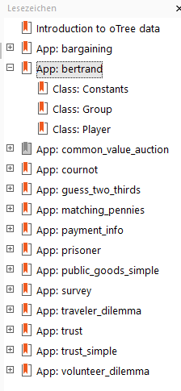
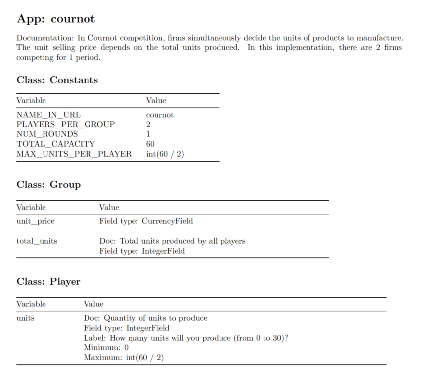

```{r collapse=TRUE, include=FALSE}
library(gmoTree)
```

# Overview

The `gmoTree` package provides tools for generating codebooks based on data from the <a href="https://www.otree.org/" target="_blank">oTree</a> (Chen et al., 2016) framework with the function `codebook()`. This vignette introduces you to the key features and functionalities, including how to adjust titles, work with oTree data, and customize output formats for your codebooks.

Disclaimer: This code has been tested with both custom implementations and official oTree sample codes.^[The oTree sample codes can be accessed when <a href="https://otree.readthedocs.io/en/latest/install-nostudio.html#install-nostudio" target="_blank">setting up an oTree project</a> (Chen et al., 2016). All examples presented in this vignette are based on the official oTree sample code, with minor modifications to meet the needs of this package.] However, due to the complexity of oTree setups, it may not address all variations. Please review your output carefully, and feel free to open a <a href="https://github.com/ZauchnerP/gmoTree/issues" target = "_blank">GitHub issue</a> if you encounter any problems.

# Running the code

In its simplest form, the function requires only the path to your oTree code. The code reads the contents of your oTree file, saves a file containing your codebook in your working directory, and returns a list named `cbook`, which contains all the information in a list format.

```
cbook <- codebook(system.file(path = "extdata/ocode_new", 
                              package = "gmoTree"))
```


# Codebook structure and output

The output is structured with clear headings:

- Heading Level 1: Represents each app in the oTree data.
- Heading Level 2: `Group` and `Player` variables, categorized within each app. Showing the class `Constants` is optional and can be turned off by using the argument `include_cons = FALSE`.



Below is an example showing the output for the `cournot` app, which includes all `Constants`, `Group`, and `Player` variables. If a class contains no information, the heading will still appear, along with the message "Empty class."



If the default codebook design does not meet your requirements, you can either reference the previously created `cbook`  list or bypass file creation by setting `output = "list"`. This will return all the information only in list format, which you can then use in `R Markdown` to design your own custom codebook. Below is an example of a section of the list output for the `cournot` app. (The argument `doc_info = FALSE` is used to omit messages about missing variable documentation.)


```{r}
cbook <- codebook(path = system.file(path = "extdata/ocode_new", 
                                     package = "gmoTree"), 
                  output = "list", 
                  doc_info = FALSE)
print(cbook$cournot)
```

# Choosing what to show

## Apps

To generate a codebook for only one app, use the `app` argument. For example, to generate a codebook for the `cournot` app:

```{r one app}
cbook <- codebook(
  path = system.file("extdata/ocode_new",
                     package = "gmoTree"),
  fsource = "init",
  output = "list",
  doc_info = FALSE,
  app = "cournot")

str(cbook)
```

The code above returns a list with the app-specific information. You can also generate codebooks for multiple apps by specifying them in the `app` argument.

```{r two apps}
cbook <- codebook(
  path = system.file("extdata/ocode_new",
                     package = "gmoTree"),
  fsource = "init",
  output = "list",
  doc_info = FALSE,
  app = c("cournot", "dictator"))

str(cbook, 1)
```

You can also choose all but remove one or more apps. Here is an example that removes the app `prisoner`.

```{r removing apps}
cbook <- codebook(
  path = system.file("extdata/ocode_new", package = "gmoTree"),
  fsource = "init",
  output = "list",
  doc_info = FALSE,
  app_rm = "prisoner")

str(cbook, 1)
```

## oTree data description

By setting the `preamb = TRUE` parameter, a predefined description of oTree data is inserted at the beginning of the codebook, explaining how experimental data is stored by oTree.


# Customizing how the codebook is shown

## Customizing the codebook titles and metadata

You can easily modify the titles, subtitles, dates, and author names in your codebooks using the following arguments:

```
codebook(
    path = "YouroTreePath",  # Can be either absolute or releative!
    title = "Codebook",
    subtitle = "Example Project",
    date = "today",
    params = list(author = c("Max Mustermann", "John Doe"))
)
```


## Sorting the code

You can sort the apps in the codebook by specifying the `sort` argument. For example:

```{r sort apps}
cbook <- codebook(
  path = system.file("extdata/ocode_new", package = "gmoTree"),
  fsource = "init",
  output = "list",
  doc_info = FALSE,
  app = c("cournot", "dictator"),
  sort = c("dictator", "cournot"))

str(cbook, 1)
```

## Referring to settings

The `gmoTree` package can automatically replace references to variables in `settings.py` with the values in the `settings.py` file.

```{r global settings}
cbook <- codebook(
  path = system.file("extdata/ocode_new", package = "gmoTree"),
  fsource = "init",
  output = "list",
  settings_replace = "global",
  app = "dictator")

print(cbook$dictator$Constants$Variable)
```

However, you can also choose to not replace them by using `settings_replace = NULL`:

```{r do not replace settings}
cbook <- codebook(
  path = system.file("extdata/ocode_new", package = "gmoTree"),
  fsource = "init",
  output = "list",
  settings_replace = NULL,
  app = "dictator")

print(cbook$dictator$Constants$Variable)
```

It is also possible to provide a list of variables that should replace the settings variables:

```{r user settings}
cbook <- codebook(
  path = system.file("extdata/ocode_new", package = "gmoTree"),
  fsource = "init",
  output = "list",
  settings_replace = "user",
  user_settings = list(variable = "someValue"),
  app = "dictator")

print(cbook$dictator$Constants$Variable)
```

# Saving your codebook

When you choose `output = "file"` or `output = "both"`, your codebook will be saved as a professional document ready for publication or sharing.

The argument `output_format` allows you to choose the format of the exported codebook file. Available formats are:

* `pdf_document`
* `html_document`
* `word_document`
* `latex_document`
* `odt_document`
* `rtf_document`
* `md_document`

You can choose the format that best suits your needs, with all formats except PDF offering easy post-generation editing.

By default, `gmoTree` codebooks are saved in your working directory with the default file name `codebook`. You can modify this by specifying a custom file name and directory path.

For example, to save the codebook with a different name, use the following code:

```
codebook(
    path = "C:/Users/username/Nextcloud/oTree",  # Replace!
    output_file = "gmoTree_codebook")
```

You can also include the file extension, though it is optional:

```
codebook(
    path = "C:/Users/username/Nextcloud/oTree",  # Replace!
    output_file = "gmoTree_codebook.pdf")
```

You can save the file in a subfolder within the current directory by including the absolute or relative folder name in the `output_file` argument. For example:

```
codebook(
    path = "C:/Users/username/Nextcloud/oTree",  # Replace!
    output_file = "codebookfiles/gmoTree_codebook.pdf")
```

However, you can also specify absolute paths, either in the `output_dir` argument or directly within the file name specified in the `output_file`.
For example:

```
codebook(
    path = "C:/Users/username/Nextcloud/oTree",  # Replace!
    output_dir  = "C:/Users/username/Nextcloud/codebooks",
    output_file = "mycodebook")
```

# Summary

This vignette covers how to customize the codebook generated by the `codebook()` function, including options for selecting content, formatting its presentation, and exporting it in various formats. These tools enable the creation of comprehensive and tailored documentation for your experimental data.

# References

Chen, D. L., Schonger, M., & Wickens, C. (2016). oTree—An open-source platform for laboratory, online, and field experiments. Journal of Behavioral and Experimental Finance, 9, 88–97. https://doi.org/10.1016/j.jbef.2015.12.001